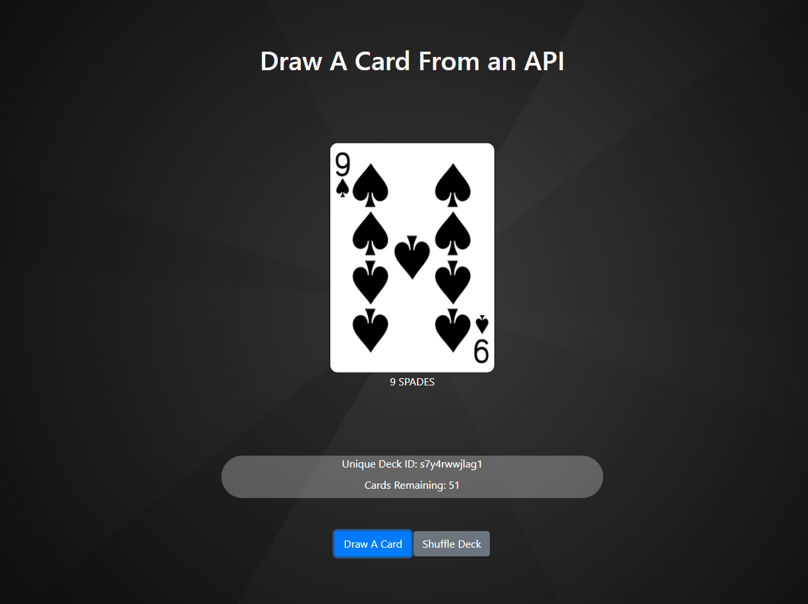

# Draw A Card From An API

Connect to the Deck of Cards API located at https://deckofcardsapi.com/

A New Deck of Cards is requested and the User can Click a button to Draw a New Card from the Deck.

If a card parameter is defined in the URL (Example: https://joshjabs.github.io/DrawACard?card=5C) then the specified card is displayed ( 5 of Clubs ).

## About This Repo

This project includes Pseudo Code for a Coding Lab. The fully functioning version is located on the 'build' branch.

This is a free educational resource released under the MIT License. Use, build, and snip from this project however you like!

Deployed to GitHub Pages and can be accessed at https://joshjabs.github.io/DrawACard/

